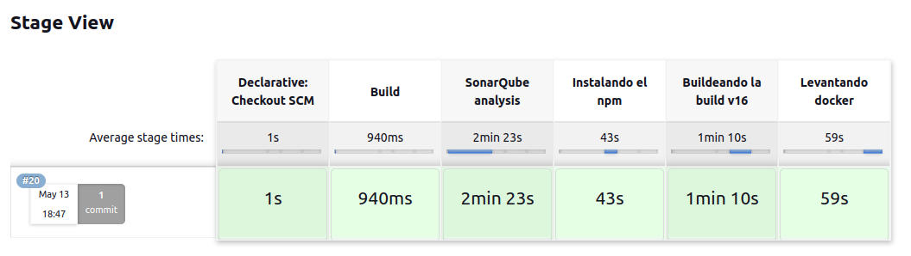
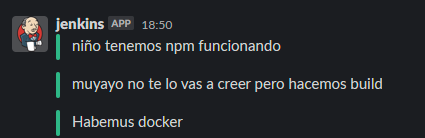

# UT4.AP02

En el proyecto que estamos llevando a cabo, se está integrando Jenkins como orquestador, lo que introduce el principio de Integración y Entrega Continua (CI/CD) que es fundamental en cualquier proceso de desarrollo moderno. 

Esta integración no solo permite detectar y solucionar problemas de manera rápida y temprana, sino que reduce el tiempo y el esfuerzo que se dedican al despliegue y a la entrega de nuevas características y correcciones de errores. Con este sistema facilitamos un desarrollo más rápido y permitiendo que el equipo se concentre más en la creación de nuevas características .

Dentro de esta integración contamos con el modulo de Jenkins Slack el cual mejora la comunicación en tiempo real dentro del equipo de desarrollo. A través de esta integración, se pueden compartir automáticamente actualizaciones sobre los cambios recientes, las fallas y los éxitos de la construcción de la aplicación

Además de esto, contamos con la incorporación de SonarQube a través de un módulo de Jenkins para realizar el control de calidad del código efectivo y automatizado. Con SonarQube realizando una revisión automática y continua del código, ayudamos a mantener el código limpio y de alta calidad. Esto reduce la cantidad de errores y problemas que podrían surgir después de la fase de desarrollo, ahorrando tiempo y esfuerzo en correcciones posteriores.

## Instalación Jenkins

Para realizar la instalación de Jenkins podemos optar por dos vias, usar Docker o instalarlo de forma nativa en el SO que estemos utilizando. Sabiendo que posteriormente desplegaremos contenedores la opción mas viable para esto es instalarlo de forma nativa en nuestro SO.

Para realizar la instalación en Ubuntu realizaremos las siguientes acciones:

```bash
#Este es el repositorio de paquetes Debian de Jenkins para automatizar la instalación y actualización. 
#Para usar este repositorio, primero agrega la clave a tu sistema:

curl -fsSL https://pkg.jenkins.io/debian-stable/jenkins.io-2023.key | sudo tee
/usr/share/keyrings/jenkins-keyring.asc > /dev/null

#Luego agregamos una entrada de repositorio apt de Jenkins:

echo deb [signed-by=/usr/share/keyrings/jenkins-keyring.asc]
https://pkg.jenkins.io/debian-stable binary/ | sudo tee
/etc/apt/sources.list.d/jenkins.list > /dev/null

#Actualizamos los paquetes y finalmente instala Jenkins:

sudo apt-get update
sudo apt-get install fontconfig openjdk-11-jre
sudo apt-get install Jenkins
```

Una vez hemos instalado Jenkins deberemos de instalar Java en concreto recomiendan instalar la versión 11, como vemos anteriormente durante el proceso de instalación se uso ya un paquete de configuración de esta versión de java. Es posible que segun la instalación realizada anteriormente se instalara Java 11 como dependencia.

```bash
$ sudo apt update
$ sudo apt install openjdk-11-jre
$ java -version
openjdk version "11.0.18" 2023-01-17
OpenJDK Runtime Environment (build 11.0.18+10-post-Ubuntu-0ubuntu122.04)
OpenJDK 64-Bit Server VM (build 11.0.18+10-post-Ubuntu-0ubuntu122.04, mixed mode, sharing)

```

Una vez instalado configuramos el SO para que el servicio de Jenkins arranque con el SO y lo iniciamos.

```bash
sudo systemctl enable jenkins
sudo systemctl start jenkins
sudo systemctl status jenkins
```

Si todo salio correcto deberiamos de ver el siguiente mensaje en pantalla.

```bash
● jenkins.service - Jenkins Continuous Integration Server
     Loaded: loaded (/lib/systemd/system/jenkins.service; enabled; vendor preset: enabled)
     Active: active (running) since Sat 2023-05-13 13:24:35 CEST; 3min 47s ago

```

Por ultimo una vez instalado podremos acceder a http://localhost:8080 y acceder a Jenkins el cual nos pedira que introduzacamos una clave de administrador que se instala en el equipo para confirmar que vamos a empezar el proceso de configuración inicial.

```bash
sudo cat /var/lib/jenkins/secrets/initialAdminPassword
XXXXXXXXXXXXXXXXXXXXXXXXXXXXXXXXX
```


## Conexión con slack

Empezaremos realizando la integración con Slack, este es un servicio de mensajeria utilizado en entornos empresariales el cual permite dividir los temas de conversación en diferentes canales y ayudar a los equipos a organizar el flujo de mensajes y trabajo. Jenkins tiene un modulo el cual podemos configurar para poder mandar mensajes de estado a uno de estos canales con el fin de poder notificar a los desarrolladores sobre el estado del pipeline.

Para realizar la conexión deberemos de hacer las siguientes acciones:

Empezaremos instalando el modulo de Jenkins que permite realizar la configuración con Slack, para ello iremos a la sección de plugins e instalaremos Slack notification.
Accedemos a Slack app directory dentro de nuestro servidor y buscamos el conector de Jenkins, en este modulo una vez instalado podremos configurar el token de acceso a la aplicación y el canal al cual le daremos acceso a Jenkins para publicar las alertas.


Una vez tenemos este token configuraremos la parte de Jenkins, para ello tendremos que establecer una credencial global en la cual configuramos el token que nos da slack en Jenkins para poder usarlo posteriormente en la conexión del plugin.

 

Configuramos el plugin estableciendo el nombre del servidor, credencial que hemos generado anteriormente y el canal por el cual le hemos permitido escribir.


Una vez realizamos esta configuración podremos realizar un mensaje de prueba para comprobar que slack se ha incorporado a Jenkins de manera correcta.


## Implementación Docker

Puesto que estamos realizando la instalación en ubuntu y usaremos docker deberemos de configurar el entorno para que este funcione de forma correcta.  Una vez instalado deberemos de configurarlo para que el proceso admita peticiones de usuarios que no sean root ya que por defecto viene asi establecido. Para ello realizaremos las siguientes acciones.

```bash
sudo groupadd docker

sudo usermod -aG docker $USER #<-- Usuario de uso normal y jenkins

newgrp docker
```


## Conexión con sonarqube

Para realizar la instalación de sonarqube empezaremos configurando un servidor en local el cual nos permitirá realizar las labores de testeo, este ira montado sobre Docker lo cual nos permitirá realizar un despliegue fácil de la aplicación.

Empezamos descargando la imagen de sonarqube para contar con ella de forma local. Tras esto podemos lanzar el docker a través del comando docker run.

```bash
docker pull sonarqube
docker run -p 9000:9000 -v sonarqube_extensions:/opt/sonarqube/extensions sonarqube:latest
```

Como vemos en la siguiente imagen una vez realizamos estas acciones tenemos sonarqube funcionando de forma correcta en nuestra maquina.


Una vez dentro de sonarqube nos dirigimos a la configuración de la cuenta y generamos un token de usuario el cual sera el que utilicemos para conectar Jenkins con Sonarqube a nivel de usuario. Este se configura exactamente igual que el que vimos anteriormente de Jenkins.


Una vez tenemos el token establecido creamos un nuevo proyecto en jenkins, una vez creado deberemos de crear un analisis local ya que nos encontramos trabajando de forma local en la maquina. Establecemos los campos que se nos pide y nos dara finalmente un comando el cual deberemos de poner en nuestro pipeline de Jenkins.


Una vez tenemos Sonarqube instalado podemos instalar el plugin que utilizaremos para conectarlo con Jenkins.


Una vez instalado podemos ir a configuración para realizar la conexión con el servidor, en este caso usaremos localhost:9000 ya que se encuentra corriendo en un docker y el nombre sera sonarqube.


En este punto podemos realizar una primera prueba para ver si tenemos bien configurado sonarqube y este realiza el testeo de la aplicación que tenemos actualmente como vemos pasa todos los test hasta el momento.


Además de esto si accedemos al dashboard de sonarqube veremos aquí reflejado los resultados dele escaneo realizado desde Jenkins.


### Configuración del pipeline

Para configurar el pipeline que usaremos para realizar todas las fases utilizaremos github, dentro de este crearemos un jenkinsfile el cual contendrá todos los comandos necesarios para realizar la ejecución.

```yaml
pipeline {
    agent any
    stages {
        stage('Build') {
            steps {
                git(
                    url: 'https://github.com/doggymux/UT4.02.git',
                    credentialsId: 'github',
                    branch: 'main'
                )
            }
        }
        stage('SonarQube analysis') {
            steps {
                echo 'Starting SonarQube analysis'
                withSonarQubeEnv('sonarqube') {
                    echo 'Inside SonarQube environment'
                   
                    sh 'cd angular && /sonar-scanner-4.8.0.2856-linux/bin/sonar-scanner \
                            -Dsonar.projectKey=PPS-P4 \
                            -Dsonar.sources=. \
                            -Dsonar.host.url=http://localhost:9000 \
                            -Dsonar.token=sqp_3640668c241c658c22f64659bf9103f51453d648'
                }
                echo 'Finished SonarQube analysis'
            }
        }
        
        stage('Instalando el npm') {
            steps {
                sh 'cd angular/ && npm install --force'
                slackSend channel: '#tito-jenkins', color: 'good', message: 'niño tenemos npm funcionando'
            }
        }
        
        stage('Buildeando la build v16') {
            steps {
                sh 'cd /var/lib/jenkins/workspace/PPS/angular && ng build --prod'
                slackSend channel: '#tito-jenkins', color: 'good', message: 'muyayo no te lo vas a creer pero hacemos build'
            }
        }
        
        stage('Levantando docker') {
            steps {
                sh 'cd /var/lib/jenkins/workspace/PPS/angular && docker build --build-arg DIST=dist/billingApp --build-arg CONFIG_FILE=nginx.conf -t doggy/anguloobstuso .'
                sh 'cd /var/lib/jenkins/workspace/PPS/java && docker build -t doggy/javasito .' 
                slackSend channel: '#tito-jenkins', color: 'good', message: 'Habemus docker'
            }
        }
    }
}
```

Como vemos en el codigo debemos de utilizar npm y ng por lo que necesitaremos instalar node.js en nuestra maquina que esta ejecutando jenkins para poder ejecutarlos. Para ello utilizaremos los siguientes comandos:

```bash
curl -fsSL https://deb.nodesource.com/setup_16.x | sudo -E bash - &&\
sudo apt-get install -y nodejs
```



Como podemos ver se ha ejecutado correctamente todo el pipeline, ademas nos han llegado las notificaciones a slack de jenkins avisando de la finalización de cada proceso.




## Reflexión sobre artículo

El articulo expone que actualmente uno de los lenguajes con mas vulnerabilidades es C, aunque esto no implique que sea el mas inseguro. Esto se debe al gran despliegue que este lenguaje tiene actualmente y al ser el lenguaje que mas tiempo ha estado en producción de todos los investigados.

Es por ello que podemos pensar que el lenguaje no es mas seguro o menos dependiendo de las vulnerabilidades que estos tengan sino como se use el lenguaje, un buen control de las funciones y estructura del código ayuda a que este sea mas seguro. No es que el lenguaje sea vulnerable es que los programadores lo hacen vulnerable.

En estos últimos años es normal como dice el texto que se detecten muchas mas vulnerabilidades gracias a las herramientas automatizadas de testeo de código que tenemos, y en los próximos años esto ira a mas añadiendo la IA a los testeos permitira detectar vulnerabilidades criticas con aun mas facilidad.
